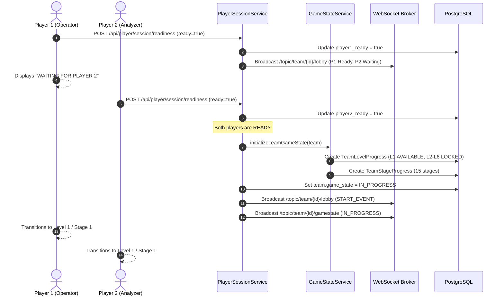
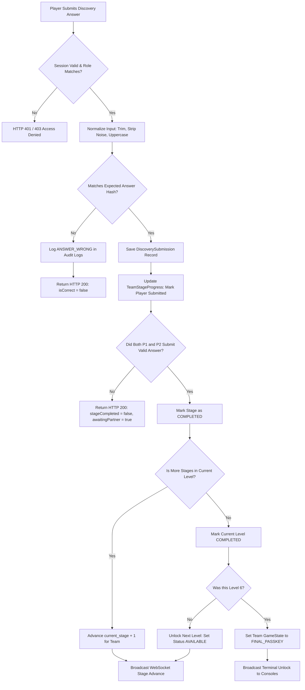

# Architecture Overview — CodeXcape Backend & System Design

This document provides a comprehensive technical reference for the **CodeXcape** backend architecture, game engine, security protocols, state machines, and real-time communication pipeline.

---

## 1. System High-Level Topology

```text
+---------------------------------------------------------------------------------------------+
|                                    NETWORK INFRASTRUCTURE                                   |
|                                                                                             |
|   +--------------------------+                         +--------------------------+         |
|   |     Player 1 Client      |                         |     Player 2 Client      |         |
|   |  (React 18 / Vite SPA)   |                         |  (React 18 / Vite SPA)   |         |
|   |  Role: Console A         |                         |  Role: Console B         |         |
|   +------------+-------------+                         +------------+-------------+         |
|                |                                                    |                       |
|                |  HTTP/REST (Fetch) + WebSocket (STOMP / SockJS)    |                       |
|                +-------------------------+--------------------------+                       |
|                                          |                                                  |
|                                          v                                                  |
|                         +----------------------------------+                                |
|                         |    Edge Gateway / Proxy          |                                |
|                         |    (Nginx / Render / Vercel)     |                                |
|                         +----------------+-----------------+                                |
|                                          |                                                  |
|                                          v                                                  |
|                         +----------------------------------+                                |
|                         |       Spring Boot 3 Backend      |                                |
|                         |       (Java 17 / Maven)          |                                |
|                         |                                  |                                |
|                         |  - Security & Dual Auth Filter   |                                |
|                         |  - Cooperative Game Engine       |                                |
|                         |  - Stage Progression Pipeline    |                                |
|                         |  - Rate Limiter & Audit Logger   |                                |
|                         |  - WebSocket Event Publisher     |                                |
|                         +----------------+-----------------+                                |
|                                          |                                                  |
|                                          | JDBC (HikariCP / JPA)                            |
|                                          v                                                  |
|                         +----------------------------------+                                |
|                         |       PostgreSQL Database        |                                |
|                         |  - Flyway Auto-Migrated (V1-V41) |                                |
|                         |  - Row-Level Pessimistic Locks   |                                |
|                         |  - Immutable Audit Event Store   |                                |
|                         +----------------+-----------------+                                |
+---------------------------------------------------------------------------------------------+
```

---

## 2. Guiding Architectural Principles

1. **Centralized Server-Authoritative Logic:**
   - All game state, event timers, level transitions, stage completion checks, hint penalties, and passkey verifications are calculated strictly on the backend.
   - The React frontend functions purely as a presentation layer and receives only role-segregated, sanitized telemetry.
2. **Two-Player Cooperative State Machine:**
   - Teams consist of exactly two roles: **Player 1 (Operator)** and **Player 2 (Analyzer)**.
   - Advancing through stages requires mutual, synchronized discovery submissions. Neither player possesses sufficient data to progress alone.
3. **Zero Secret Leakage:**
   - Raw passkeys (e.g. `849201`), opposing player answers, and solution hashes are never serialized or sent in API responses to client browsers.
   - Passkey verification occurs via BCrypt hash comparisons on the server.
4. **Network Resilience & Dual-Mode Transport:**
   - Real-time updates utilize WebSockets (STOMP over SockJS) backed by automated HTTP REST polling fallbacks for environments where WebSockets are blocked by proxies or firewalls.
   - Cross-origin authentication supports both secure cookies and dual HTTP headers (`Authorization: Bearer <token>` and `X-Player-Session` / `X-Admin-Session`) to prevent cross-site cookie blocking.

---

## 3. Backend Layered Architecture

The backend is built with **Spring Boot 3** and **Java 17**, structured into distinct, decoupled architectural layers:

```text
com.technicalescaperoom.backend
├── config/                      # Infrastructure & Protocol Configuration
│   ├── CorsConfig.java          # Cross-Origin Resource Sharing (allowed origins/headers)
│   ├── FlywayConfig.java        # DB Migration lifecycle, automatic repair on boot
│   ├── SecurityConfig.java      # Spring Security filter chains & public/private route rules
│   ├── WebSocketConfig.java     # STOMP broker registration & SockJS endpoint setup
│   ├── security/                # Custom security filters, tokens, and principals
│   │   ├── PlayerSessionAuthenticationFilter.java  # Dual-mode session token evaluator
│   │   ├── RateLimitingFilter.java                 # Sliding window / burst attack protection
│   │   ├── PlayerPrincipal.java                    # Thread-local player context
│   │   └── AdminPrincipal.java                     # Thread-local organizer context
│   └── websocket/               # WebSocket session listeners and disconnect tracking
├── controller/                  # REST API Gateways
│   ├── admin/                   # Organizer management, team controls, live event controls
│   ├── player/                  # Player login, lobby, question fetch, submit, passkey
│   └── publicapi/               # Unauthenticated public scoreboard and health endpoints
├── service/                     # Core Business Logic & State Machines
│   ├── PlayerSessionService.java    # Login, lobby sync, dual readiness, session lifecycles
│   ├── GameStateService.java        # Team game state, level unlocking, stage transitions
│   ├── QuestionAnswerService.java   # Asymmetric question isolation, normalized verification
│   ├── FinalPasskeyService.java     # Master passkey validation, row locking, event completion
│   ├── HintService.java             # Tiered progressive hints and time penalties
│   ├── GameWebSocketPublisher.java  # Real-time event broadcasting to STOMP channels
│   └── AuditService.java            # Immutable security and game event logging
├── repository/                  # Spring Data JPA Data Access Objects
└── entity/                      # JPA Database Entities (PostgreSQL schema mappings)
```

---

## 4. Player Session & Lobby Synchronization Engine

The `PlayerSessionService` governs authentication, team assignment, concurrent session limits, and the synchronized lobby start flow.

### 4.1. Authentication & Dual-Mode Token Transport

When a player submits credentials (Team Code, Player Number, Passcode):
1. **Team Resolution:** Matches the sanitized team code (`CODEXCAPE-TEST`, `TEAM-ALPHA`, etc.) and verifies the event is `READY` or `RUNNING`.
2. **Eligibility Validation:** Verifies the team is active (`NOT_STARTED` or `IN_PROGRESS`) and not disqualified.
3. **Player Credential Verification:** Compares the passcode with the BCrypt hash stored in the `players` table.
4. **Session Generation:** Creates a `game_sessions` entry with a cryptographically secure 64-character UUID token, active timestamp, and IP/User-Agent tracking.
5. **Dual-Mode Response Delivery:**
   - **Cookie:** Injects an `HttpOnly`, `SameSite=None`, `Secure` cookie named `PLAYER_SESSION`.
   - **JSON Body:** Returns the raw session token in the response DTO (`sessionToken`).
   - **Filter Handling (`PlayerSessionAuthenticationFilter`):** Checks `X-Player-Session` or `Authorization: Bearer <token>` first. If absent, falls back to the `PLAYER_SESSION` cookie. This eliminates third-party cookie blocking issues between decoupled frontend hosts (e.g. Vercel) and backend servers (e.g. Render).

### 4.2. Team Lobby & Two-Player Readiness Flow



---

## 5. Game Engine & Stage Progression Pipeline

The escape room features **6 Levels** containing a total of **15 Stages**. Game progress is governed by `GameStateService` and `QuestionAnswerService`.

### 5.1. Sequential Level and Stage Model

```text
Level 1: System Reconstruction   --> Stage 1 (Log Collision)     --> Stage 2 (Access Panel)
Level 2: Data Vault              --> Stage 1 (Fragment Vault)    --> Stage 2 (Transformation Chamber)
Level 3: Network Incident        --> Stage 1 (Network Topology)  --> Stage 2 (Trace Connection)    --> Stage 3 (Packet Recovery)
Level 4: Encrypted Room          --> Stage 1 (Cipher Discovery)  --> Stage 2 (Decryption Matrix)
Level 5: Collapsed System        --> Stage 1 (Evidence Board)    --> Stage 2 (Evidence Chain)      --> Stage 3 (Pattern Extraction)
Level 6: The Core                --> Stage 1 (Dual Key)          --> Stage 2 (Core Reconstruction) --> Stage 3 (Final Protocol)
                                                                                                              |
                                                                                                              v
                                                                                                     Master Passkey Terminal (849201)
```

1. **Active Level Isolation:** Only the current level is marked `AVAILABLE` or `IN_PROGRESS` in `team_level_progress`. All subsequent levels remain `LOCKED` until the active level is finished.
2. **Role-Based Question Isolation:**
   - When Player 1 calls `GET /api/player/questions/current`, the backend filters strictly by `player_number = 'PLAYER_1'`.
   - Player 1 never receives Player 2's clues, telemetry, or instructions, ensuring asymmetric dependence.

### 5.2. Asymmetric Discovery Submission & Convergence



### 5.3. Text Normalization Rules

To prevent trivial mismatches caused by formatting, the backend uses deterministic normalization:
```java
public static String normalizeAnswer(String raw) {
    if (raw == null) return "";
    return raw.trim()
              .replaceAll("[\\t\\r\\n]+", " ")
              .replaceAll("\\s+", " ")
              .toUpperCase();
}
```

---

## 6. Final Master Passkey Engine

The final challenge requires players to synthesize clues gathered across all 6 levels into a 6-digit passkey (`849201`). This is processed by `FinalPasskeyService`.

### 6.1. Concurrency Protection & Row-Level Locking

In high-stress competition environments, both teammates often submit the passkey simultaneously. To prevent race conditions, duplicate completion events, and corrupted leaderboard timestamps:
```java
// Pessimistic Write Lock acquires a row lock on the Team record in PostgreSQL:
// SELECT * FROM teams WHERE id = ? FOR UPDATE
Team team = teamRepository.findForUpdateById(principal.getTeamId())
        .orElseThrow(() -> new ResourceNotFoundException("Team not found"));
```

### 6.2. Validation & Timing-Attack Resistance

1. **Eligibility Check:** The team must have all 6 levels marked as `COMPLETED` and the team state must be `FINAL_PASSKEY`.
2. **Time Window Check:** Ensures the event has not elapsed (e.g. 90-minute deadline) and is not `PAUSED`.
3. **BCrypt Hash Verification:**
   ```java
   boolean isCorrect = passwordEncoder.matches(submittedPasskey, event.getPasskeyHash());
   ```
   - Uses constant-time salt comparison to eliminate timing side-channel attacks.
4. **Completion Execution:**
   - Sets `team.setGameState(TeamGameState.COMPLETED)`.
   - Records `team.setCompletedAt(Instant.now())`.
   - Triggers `AuditService.logEvent(GameEventType.EVENT_COMPLETED)`.
   - Broadcasts the victory event via WebSocket to the team and admin consoles.
   - Triggers a real-time recalculation of the public leaderboard.

---

## 7. Progressive Hint & Time Penalty Subsystem

Teams can request hints through `HintService`:

* **Tier 1 (Subtle Nudge):** Confirms direction; adds **+2 minutes** time penalty.
* **Tier 2 (Structural Hint):** Reveals specific relations/components; adds **+5 minutes** time penalty.
* **Tier 3 (Direct Clarification):** Explicitly describes the logic requirement; adds **+10 minutes** time penalty.

### Scoring Calculation
A team's official competition score and ranking are computed as:
$$\text{Effective Time} = (\text{Completed Timestamp} - \text{Event Start Timestamp}) + \sum \text{Hint Penalties} - \text{Paused Duration}$$
Lower effective time ranks higher on the leaderboard.

---

## 8. Real-Time Telemetry & WebSocket Pipeline

CodeXcape implements a **STOMP over SockJS** WebSocket layer configured in `WebSocketConfig.java` and orchestrated by `GameWebSocketPublisher`.

### 8.1. STOMP Topic Hierarchy

| Topic Destination | Audience | Payload / Purpose |
| :--- | :--- | :--- |
| `/topic/team/{teamId}/lobby` | Team Players | Readiness updates, player connect/disconnect, `START_EVENT` |
| `/topic/team/{teamId}/gamestate` | Team Players | Level unlocking, stage advance, hint penalization, game completion |
| `/topic/team/{teamId}/alerts` | Team Players | Administrative notices, time warnings, pause/resume alerts |
| `/topic/admin/leaderboard` | Organizers & Public | Real-time score updates, ranks, level progress |
| `/topic/admin/audit` | Organizers | Live stream of security events, failed attempts, and logins |

### 8.2. Failover & Polling Hybrid Architecture

If a client's network environment (e.g., enterprise proxies, SSL inspection, restrictive NATs) drops the WebSocket connection:
1. The frontend STOMP client fires an `onDisconnect` listener.
2. The UI automatically activates an adaptive **HTTP REST polling loop** (polling `/api/player/gamestate` and `/api/player/session/lobby` every 2.5 seconds).
3. Once the network stabilizes, the client transparently re-establishes the WebSocket connection and resumes event-driven updates.

---

## 9. Database Architecture & Schema

The PostgreSQL database is initialized and versioned using **Flyway Database Migrations** (`db/migration/V1__...` to `V41__...`).

### 9.1. Entity Relationship Diagram (Core Tables)

```text
+-------------------+       1:N       +-------------------+       1:N       +-------------------+
|      events       | <-------------> |       teams       | <-------------> |      players      |
|-------------------|                 |-------------------|                 |-------------------|
| id (PK)           |                 | id (PK)           |                 | id (PK)           |
| title             |                 | event_id (FK)     |                 | team_id (FK)      |
| status            |                 | team_code (UNIQUE)|                 | player_number (1|2)
| start_time        |                 | game_state        |                 | passcode_hash     |
| passkey_hash      |                 | completed_at      |                 | is_ready          |
+-------------------+                 +-------------------+                 +-------------------+
                                                |
                                                | 1:N
                                                v
+-------------------+       1:N       +-----------------------+
|      levels       | <-------------> |  team_level_progress  |
|-------------------|                 |-----------------------|
| id (PK)           |                 | id (PK)               |
| level_number (1-6)|                 | team_id (FK)          |
| name              |                 | level_id (FK)         |
| is_active         |                 | level_status          |
+-------------------+                 +-----------------------+
          |                                     |
          | 1:N                                 | 1:N
          v                                     v
+-------------------+                 +-----------------------+
|     questions     |                 |  team_stage_progress  |
|-------------------|                 |-----------------------|
| id (PK)           |                 | id (PK)               |
| level_id (FK)     |                 | team_id (FK)          |
| stage_number      |                 | stage_number          |
| player_number     |                 | p1_submitted (BOOL)   |
| evidence          |                 | p2_submitted (BOOL)   |
| expected_answer   |                 | is_completed (BOOL)   |
+-------------------+                 +-----------------------+
```

### 9.2. Automated Flyway Startup Repair

To prevent application crashes caused by orphaned migration locks or checksum discrepancies during continuous deployment, `FlywayConfig.java` executes an automatic repair prior to migration:
```java
@Bean
public FlywayMigrationStrategy cleanMigrateStrategy() {
    return flyway -> {
        flyway.repair();
        flyway.migrate();
    };
}
```

---

## 10. Security, Rate Limiting & Anti-Cheat Controls

1. **Role Separation & Thread-Local Context:**
   - Every request is validated by `PlayerSessionAuthenticationFilter`. Valid tokens are unpacked into a `PlayerPrincipal` stored in the Spring `SecurityContextHolder`.
   - Controllers never accept a `teamId` or `playerNumber` from URL parameters or request bodies; all IDs are resolved server-side from the authenticated principal.
2. **Rate Limiting (`RateLimitingFilter`):**
   - Restricts brute-force answer submissions and passkey guessing (max 10 submissions per minute per player session).
   - Exceeding the rate limit returns `HTTP 429 Too Many Requests`.
3. **Immutable Audit Trail (`AdminAuditLog`):**
   - Every significant action (`PLAYER_LOGIN`, `READINESS_TOGGLE`, `ANSWER_SUBMITTED`, `ANSWER_WRONG`, `STAGE_ADVANCED`, `HINT_REQUESTED`, `FINAL_PASSKEY_SUBMISSION`, `EVENT_COMPLETED`) is written to an append-only audit table with IP address, timestamp, and JSON metadata.
4. **Zero-Knowledge Challenge Delivery:**
   - Hints and answers for subsequent levels are never loaded into memory for a team until that level is legitimately reached and active.
